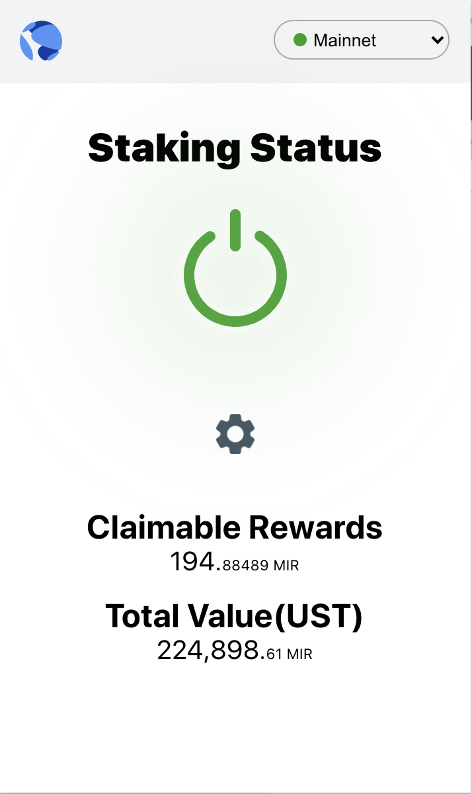

# Autostaker Browser Extension

Autostaker is a mirror protocol automatic re-staker chrome extension. Mirror protocol short pools typically require a manual collecting selling for 50/50 with UST and restaking. This extension simplifies all of those steps and lets you compound those gains with a single button!

The extension re-implements the standalone autostaker from [Autostaker by YunSuk Yeo](https://github.com/YunSuk-Yeo/autostaker) and makes it accesible to those whom don't know how to program.

## Screenshots

## Building locally

- Install [Node.js](https://nodejs.org) version 14
    - If you are using [nvm](https://github.com/creationix/nvm#installation) (recommended) running `nvm use` will automatically choose the right node version for you.
- Install dependencies: `npm install`
- Build the project to the `./dist/` folder with `npm run build`.

## Contributing

The project is completely open source. Feel free to contribute!
